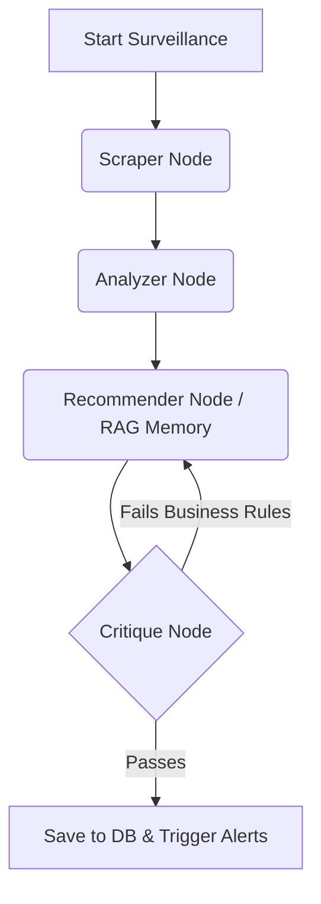

# 📈 BargainHunter B2B Real-Time Market & Pricing Surveillance Agent

[](https://fastapi.tiangolo.com/)
[](https://langchain.com/)
[](https://streamlit.io/)
[](https://www.mysql.com/)

An autonomous, **Enterprise-Grade AI Agent** built for the **Web Data UNLOCKED Hackathon (GTM Intelligence & Finance Track)**. This system navigates e-commerce search results, extracts competitor pricing, analyzes market sentiment, and generates strategic B2B pricing recommendations in real-time.

---

## 🌟 Key Features

### 1. 🧠 Elite LangGraph AI Architecture
Powered by a multi-node AI workflow:
- **Scraper Node**: Utilizes Bright Data to scrape target URLs, applying rigorous semantic filtering to ignore irrelevant accessories and focus solely on the core component.
- **Analyzer Node**: Aggregates extracted products, identifying price anomalies and market leaders (Cheapest & Best Rated).
- **Recommender Node**: Employs **RAG (Retrieval-Augmented Generation)** via Pinecone to recall past intelligence reports, providing historical context for strategy formulation.
- **Critique Node (The Manager)**: Implements a **Self-Reflection Loop**. It evaluates the Recommender's strategy against strict enterprise business rules (e.g., "Never drop prices without a price anomaly"). If the strategy fails, the graph loops back and forces the AI to revise its strategy.

### 2. ⚡ Real-Time Streaming Execution
The FastAPI backend utilizes LangGraph's `.astream()` to broadcast the agent's exact execution steps (node-by-node) to the database, allowing the frontend dashboard to display the AI's "thought process" live to the user.

### 3. 🚨 Enterprise B2B Alerting
Integrated notification service designed to alert GTM and Finance teams via Slack or terminal webhooks whenever a high-priority pricing anomaly or aggressive marketing strategy (`MARKETING_BLITZ` / `ADJUST_PRICE`) is detected.

---

## 🛠️ Tech Stack

- **Backend**: FastAPI, Python 3.10+, SQLAlchemy (ORM)
- **AI / LLM Orchestration**: LangGraph, LangChain, OpenRouter (GPT-4o-mini)
- **Data Extraction**: Bright Data MCP (Model Context Protocol)
- **Vector Memory**: Pinecone
- **Relational Database**: MySQL (Aiven)
- **Frontend Prototype**: Streamlit

---

## 🚀 Getting Started

### Prerequisites
- Python 3.10 or higher
- MySQL Database
- Pinecone Account
- OpenRouter API Key
- Bright Data Account

### 1. Clone the Repository
```bash
git clone https://github.com/yourusername/supply_chain_system.git
cd supply_chain_system
```

### 2. Environment Variables
Create a `.env` file in the root directory. Use the provided `.env.example` as a template:
```bash
cp .env.example .env
```
Fill in your API keys and database credentials in `.env`.

### 3. Install Dependencies
```bash
pip install -r requirements.txt
```

### 4. Run the Backend (FastAPI)
The backend manages the database connections and the LangGraph workflow.
```bash
uvicorn backend.app.main:app --reload
```
*API Documentation will be available at `http://127.0.0.1:8000/docs`*

### 5. Run the Frontend (Streamlit)
Open a new terminal window and run:
```bash
streamlit run frontend/app.py
```
*The interactive dashboard will open in your browser at `http://localhost:8501`*

---

## 🧠 AI Agent Flow Diagram



## 🤝 Handover to Frontend Team
The backend API is robust and fully complete. The frontend team can interact with the following core endpoints:
- `POST /api/v1/surveillance/analyze` - Start a new intelligence gathering task.
- `GET /api/v1/surveillance/task/{task_id}` - Poll the real-time status of a task (`running_scraper`, `running_analyzer`, etc.) and retrieve the final JSON result.
- `GET /api/v1/surveillance/tasks` - Fetch the history of all intelligence reports to build a dashboard timeline.

---
*Built with ❤️ for Web Data UNLOCKED.*

---

## 📚 API Documentation

Welcome to the API Documentation for the Real-Time Market & Pricing Surveillance Agent. This backend is built using FastAPI and provides endpoints to trigger background web data scraping, analyze supply chain components, and monitor tasks.

### Base URL

By default, the backend runs locally at: `http://localhost:8000`

> [!TIP]
> **Interactive Documentation**
> Because this project is built with FastAPI, you get interactive documentation for free! Once the server is running, you can visit:
> - **Swagger UI:** [http://localhost:8000/docs](http://localhost:8000/docs) (Best for testing endpoints interactively)
> - **ReDoc:** [http://localhost:8000/redoc](http://localhost:8000/redoc) (Great for readable, static documentation)

---

### 1. System Health

#### `GET /health`

Checks if the API is running correctly.

**Response:**
```json
{
  "status": "ok",
  "project": "Supply Chain System"
}
```

---

### 2. Surveillance Operations

All surveillance endpoints are located under the `/api/v1/surveillance` prefix.

#### `POST /api/v1/surveillance/analyze`

Triggers a new background surveillance task for a specific target URL and component. The scraping and AI analysis (LangGraph) will run asynchronously in the background.

**Request Body (`application/json`):**
```json
{
  "target_url": "https://example.com/products/cpu",
  "target_component": "Processor"
}
```
*   `target_url` (string, required): The URL to scrape and analyze.
*   `target_component` (string, required): The specific supply chain component to evaluate (e.g., "Processor", "GPU", "Lithium").

**Response (`200 OK`):**
```json
{
  "task_id": 1,
  "status": "pending",
  "message": "Surveillance task started successfully."
}
```
*   `task_id` (integer): The unique identifier for the initiated task. You can use this ID to poll for status.

---

#### `GET /api/v1/surveillance/task/{task_id}`

Retrieves the current status and results of a specific surveillance task.

**Path Parameters:**
*   `task_id` (integer, required): The ID of the task.

**Response (`200 OK`):**
```json
{
  "id": 1,
  "target_url": "https://example.com/products/cpu",
  "target_component": "Processor",
  "status": "completed",
  "result_data": "{\"extracted_products\": [...], \"market_analysis\": \"...\", \"price_anomaly\": \"...\", \"recommendation\": \"...\", \"decision\": \"...\"}",
  "created_at": "2026-05-26T10:00:00.000Z"
}
```
*   `status` (string): The current state of the task (e.g., `pending`, `running`, `running_scraper`, `completed`, `failed`).
*   `result_data` (string, nullable): A JSON string containing the final analytical results from the AI agent. Only populated once the status is `completed` or `failed`.

**Error Response (`404 Not Found`):**
```json
{
  "detail": "Task not found"
}
```

---

#### `GET /api/v1/surveillance/tasks`

Fetches a history list of surveillance tasks, ordered by creation date descending. Useful for populating the frontend dashboard.

**Query Parameters:**
*   `limit` (integer, optional): Maximum number of tasks to return. Default is `50`.

**Response (`200 OK`):**
```json
[
  {
    "id": 2,
    "target_url": "https://example.com/products/gpu",
    "target_component": "Graphics Card",
    "status": "running",
    "result_data": null,
    "created_at": "2026-05-26T10:15:00.000Z"
  },
  {
    "id": 1,
    "target_url": "https://example.com/products/cpu",
    "target_component": "Processor",
    "status": "completed",
    "result_data": "...",
    "created_at": "2026-05-26T10:00:00.000Z"
  }
]
```

---

### Data Structures

#### `result_data` JSON Schema

When a task completes successfully, the `result_data` string field will parse into the following JSON structure:

```json
{
  "extracted_products": [ ... ],
  "market_analysis": { ... },
  "price_anomaly": { ... },
  "recommendation": "String detailing the strategic recommendation",
  "decision": "String indicating the final business decision"
}
```
*(Structure varies slightly depending on the output of the LangGraph AI nodes)*
