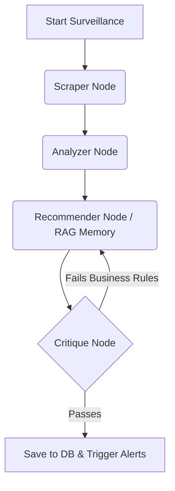

# 📈 BargainHunter B2B Real-Time Market & Pricing Surveillance Agent

[](https://fastapi.tiangolo.com/)
[](https://langchain.com/)
[](https://streamlit.io/)
[](https://www.mysql.com/)

An autonomous, **Enterprise-Grade AI Agent** built for the **Web Data UNLOCKED Hackathon (GTM Intelligence & Finance Track)**. This system navigates e-commerce search results, extracts competitor pricing, analyzes market sentiment, and generates strategic B2B pricing recommendations in real-time.

---

## 🌟 Key Features

### 1. 🧠 Elite LangGraph AI Architecture
Powered by a multi-node AI workflow:
- **Scraper Node**: Utilizes Bright Data to scrape target URLs, applying rigorous semantic filtering to ignore irrelevant accessories and focus solely on the core component.
- **Analyzer Node**: Aggregates extracted products, identifying price anomalies and market leaders (Cheapest & Best Rated).
- **Recommender Node**: Employs **RAG (Retrieval-Augmented Generation)** via Pinecone to recall past intelligence reports, providing historical context for strategy formulation.
- **Critique Node (The Manager)**: Implements a **Self-Reflection Loop**. It evaluates the Recommender's strategy against strict enterprise business rules (e.g., "Never drop prices without a price anomaly"). If the strategy fails, the graph loops back and forces the AI to revise its strategy.

### 2. ⚡ Real-Time Streaming Execution
The FastAPI backend utilizes LangGraph's `.astream()` to broadcast the agent's exact execution steps (node-by-node) to the database, allowing the frontend dashboard to display the AI's "thought process" live to the user.

### 3. 🚨 Enterprise B2B Alerting
Integrated notification service designed to alert GTM and Finance teams via Slack or terminal webhooks whenever a high-priority pricing anomaly or aggressive marketing strategy (`MARKETING_BLITZ` / `ADJUST_PRICE`) is detected.

---

## 🛠️ Tech Stack

- **Backend**: FastAPI, Python 3.10+, SQLAlchemy (ORM)
- **AI / LLM Orchestration**: LangGraph, LangChain, OpenRouter (GPT-4o-mini)
- **Data Extraction**: Bright Data MCP (Model Context Protocol)
- **Vector Memory**: Pinecone
- **Relational Database**: MySQL (Aiven)
- **Frontend Prototype**: Streamlit

---

## 🚀 Getting Started

### Prerequisites
- Python 3.10 or higher
- MySQL Database
- Pinecone Account
- OpenRouter API Key
- Bright Data Account

### 1. Clone the Repository
```bash
git clone https://github.com/yourusername/supply_chain_system.git
cd supply_chain_system
```

### 2. Environment Variables
Create a `.env` file in the root directory. Use the provided `.env.example` as a template:
```bash
cp .env.example .env
```
Fill in your API keys and database credentials in `.env`.

### 3. Install Dependencies
```bash
pip install -r requirements.txt
```

### 4. Run the Backend (FastAPI)
The backend manages the database connections and the LangGraph workflow.
```bash
uvicorn backend.app.main:app --reload
```
*API Documentation will be available at `http://127.0.0.1:8000/docs`*

### 5. Run the Frontend (Streamlit)
Open a new terminal window and run:
```bash
streamlit run frontend/app.py
```
*The interactive dashboard will open in your browser at `http://localhost:8501`*

---

## 🧠 AI Agent Flow Diagram



## 🤝 Handover to Frontend Team
The backend API is robust and fully complete. The frontend team can interact with the following core endpoints:
- `POST /api/v1/surveillance/analyze` - Start a new intelligence gathering task.
- `GET /api/v1/surveillance/task/{task_id}` - Poll the real-time status of a task (`running_scraper`, `running_analyzer`, etc.) and retrieve the final JSON result.
- `GET /api/v1/surveillance/tasks` - Fetch the history of all intelligence reports to build a dashboard timeline.

---
*Built with ❤️ for Web Data UNLOCKED.*
